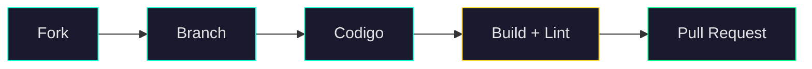

# Contribuindo com o CyberLens

Obrigado pelo interesse em contribuir! Este documento explica como configurar o ambiente, os padrões de código e o processo para enviar contribuições.

---

## Como Contribuir

Todas as contribuições são bem-vindas: correções de bugs, novas funcionalidades, melhorias de documentação e sugestões.



1. Faça um **fork** do repositório
2. Crie uma **branch** a partir de `master` (ex.: `feat/novo-provedor` ou `fix/erro-parse`)
3. Realize suas alterações seguindo os padrões abaixo
4. Rode `npm run build` e `npm run lint` sem erros
5. Abra um **Pull Request** descrevendo o que foi feito

---

## Configuração do Ambiente

> **Pré-requisitos:** Node.js 18+ e npm 9+

```bash
# 1. Clone o repositório
git clone https://github.com/eoLucasS/CyberLens.git

# 2. Instale as dependências
cd CyberLens && npm install

# 3. Inicie o servidor de desenvolvimento
npm run dev
```

A aplicação estará disponível em [http://localhost:3000](http://localhost:3000).

### Scripts disponíveis

| Comando | O que faz |
|---------|-----------|
| `npm run dev` | Servidor de desenvolvimento (Turbopack) |
| `npm run build` | Build de produção |
| `npm run lint` | ESLint + verificação de tipos |
| `npm run format` | Formata todos os arquivos (Prettier) |

---

## Padrões de Código

### TypeScript

- Modo `strict` ativado, **zero uso de `any`**
- Prefira `interface` para objetos e `type` para unions
- Exporte sempre os tipos criados

### Linguagem

| Onde | Idioma |
|------|--------|
| Comentários de código | Inglês |
| Texto visível ao usuário (UI) | Português do Brasil (pt-BR) |
| Nomes de variáveis e funções | Inglês (camelCase) |
| Commits | Inglês ou português (Conventional Commits) |

### Componentes React

- Componentes funcionais com named exports (sem default em componentes)
- Lógica de estado e efeitos em custom hooks (`src/hooks/`)
- Props tipadas com `interface` + sufixo `Props` (ex.: `ButtonProps`)
- Um componente por arquivo

### Importações

- Use importações absolutas com `@/` (configurado no `tsconfig.json`)
- Ordem: externos > internos > tipos

```ts
import { useState } from 'react';
import { Button } from '@/components/ui/Button';
import type { AnalysisResult } from '@/types';
```

---

## Como Adicionar um Novo Provedor de IA

<details>
<summary><strong>Passo a passo completo</strong></summary>

### 1. Configuração em `src/constants/providers.ts`

Adicione um novo objeto no array `AI_PROVIDERS`:

```ts
{
  name: 'nome-do-provedor',
  label: 'Nome Exibido',
  requiresProxy: false,       // true se a API bloqueia CORS
  apiKeyPlaceholder: 'prefix...',
  docsUrl: 'https://...',
  models: [
    {
      id: 'id-exato-do-modelo',
      name: 'Nome do Modelo',
      description: 'Descrição em pt-BR.',
    },
  ],
}
```

### 2. Função de chamada em `src/lib/ai/index.ts`

Crie `callNomeDoProvedor(params)` que:

- Faz a requisição HTTP para a API
- Extrai o texto da resposta
- Lança `Error` com mensagem em pt-BR se falhar

Adicione ao mapa `providerCallers`.

### 3. Handler de teste de conexão

No mesmo arquivo, adicione o case no `testConnection` para o novo provedor. O teste deve enviar um prompt mínimo e retornar `{ success, message }`.

### 4. Proxy CORS (se necessário)

Se o provedor bloqueia requests do browser, crie uma API Route em `src/app/api/proxy/nome/route.ts`. A rota deve apenas repassar a requisição sem armazenar dados.

### 5. Tipos

Se o provedor precisa de campos extras além de `apiKey` e `model`, adicione em `src/types/settings.ts`.

</details>

---

## Convenção de Commits

Padrão [Conventional Commits](https://www.conventionalcommits.org/):

| Prefixo | Uso |
|---------|-----|
| `feat:` | Nova funcionalidade |
| `fix:` | Correção de bug |
| `docs:` | Documentação |
| `style:` | Formatação (sem mudança de lógica) |
| `refactor:` | Refatoração |
| `chore:` | Manutenção (deps, configs) |

Exemplos:

```
feat: add Mistral AI provider support
fix: resolve timeout on Google Gemini API calls
docs: update API key configuration guide
```

---

## Pull Request

1. `npm run build` e `npm run lint` devem passar **sem erros**
2. Descreva **o que** foi feito e **por que** no corpo do PR
3. Referencie a issue com `Closes #número` (se houver)
4. Use o template de PR fornecido em `.github/PULL_REQUEST_TEMPLATE.md`

Para mudanças grandes, abra uma **issue** primeiro para alinhar a abordagem.

---

<div align="center">

Obrigado por contribuir!

</div>
